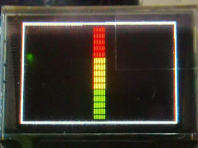
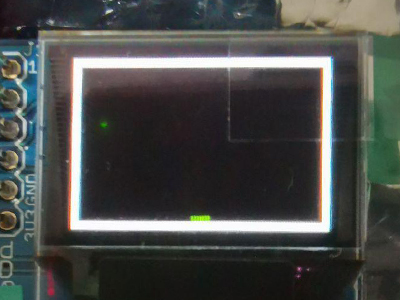
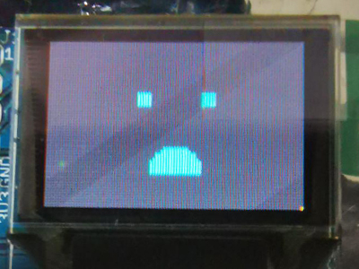
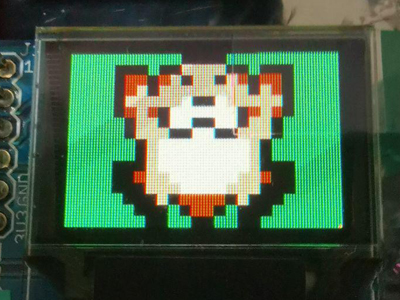
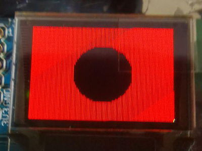

# project_mole
Whack-a-mole game on Basys 3 FPGA

This repo contains the source code (in Verilog) for implementing a sound volume display and whack-a-mole game on the Basys 3 Artix-7 FPGA board. My partner and I worked on this project as part of the EE2026 Digital Design module.

A microphone and an oled display was connected to the Basys board. The mic captures audio and displays it as a volume bar on the screen. Flipping a switch allows the player to enter game mode, which starts 'Whack-a-mole'.

Upon game start, either a mole or a bomb appears at random intervals. To "whack", the player has to make a loud sound, such as a clap, which is registered by the mic. The scoreboard is displayed using the 7-segments display built into the Basys board, and the number of "lives" the player has left is shown as a corresponding number of lit LEDs on the bottom of the board. Whacking the mole scores a point, while whacking a bomb consumes a "life".

Photos of the oled display:

    
